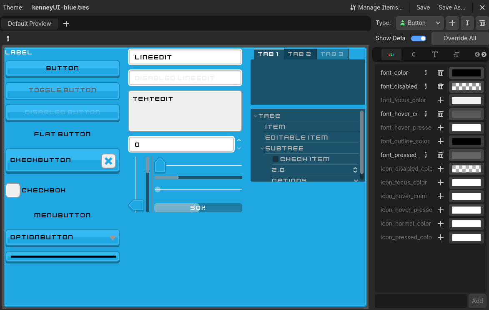
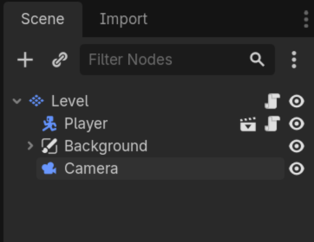
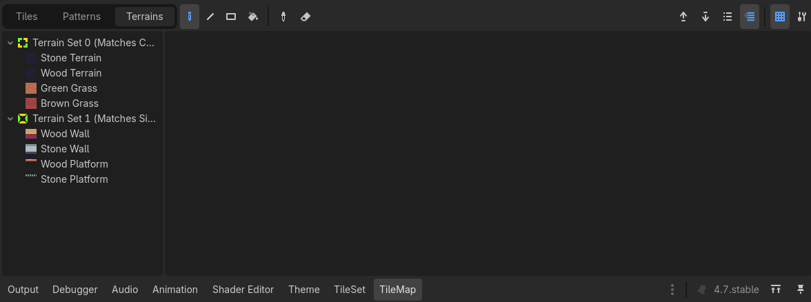
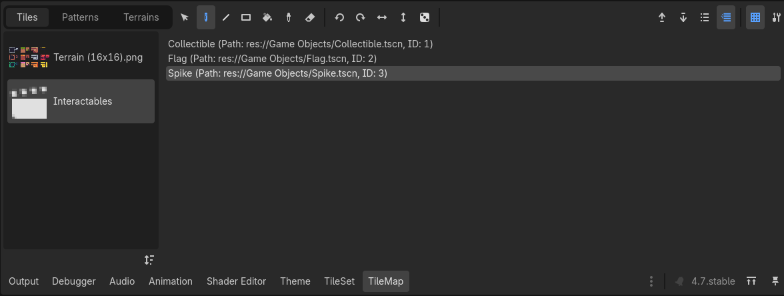

# Overview
To learn isolated parts of game development, you'll be working on top of a prototype for a platformer made with an asset pack found online.

The absolute best way to get really good at Godot is to learn from the documentation and official tutorials directly, so I will be referencing those often, and I highly recommend you check it out! The introduction page is [here](https://docs.godotengine.org/en/stable/). You can also make use of the documentation in-engine. Right-click any node and click open documentation to look at a nice overview of what something does (with significant technical detail). When programming, you can do the same with any function or class or node type to find it in the documentation or open where it is defined. 

Although this project is designed to be worked on in solos, there is no reason we can't move some of your features between projects, or eventually start a shared project with all of your implementations!

The [asset page](https://pixelfrog-assets.itch.io/pixel-adventure-1) for all the sprites also has a playable demo which helps to outline some features that I haven't implemented, but you could. Use it as inspiration.
# Main Menu
The current menu looks a bit… weak. Perhaps you can juice it up, or add some features? It has basic functionality to press play and select a level, but that’s it.
## Art
Most games have an artsy version of the name of the game in big bold letters. Design a centrepiece to put above the buttons.

The background is similarly boring. See if you can achieve a scroll effect (with an animation player) like in the original demo, or customise it however you’d like. You could also apply this to the levels.
## Themes
Within the External folder, there is a FlatUI4 folder, which contains a few UI themes (.tres files). Double-click on any of these themes within Godot to see a preview of what they look like (the buttons and text changes don’t affect anything). Below is a screenshot of an example preview:

You can drag and drop these files onto the Theme property of any control node (any green node) and it will take on the appropriate visuals. To understand more about themes and how interfaces work in games, have a look at [the docs](https://docs.godotengine.org/en/stable/tutorials/ui/gui_skinning.html).
## Expanding the Menu
Seeing as there’s very few buttons in the main menu, you might want to add some more “dummy” buttons (which do nothing) or, if you're feeling a little wild, you can add buttons that DO something (crazy). For example, a quit button or a settings menu (you might want some help to hook up the buttons using signals) so that you can mess around with sliders and other widgets.

However, it can be hard to get interfaces to be laid out exactly how you’d like, so you can learn how to manage that properly on [the docs](https://docs.godotengine.org/en/stable/tutorials/ui/size_and_anchors.html).

If you want some more complex and reusable behaviour in your interfaces, you might want to learn how to use containers too, which you can read about on this [this page](https://docs.godotengine.org/en/stable/tutorials/ui/gui_containers.html). The main menu already makes use of some containers, which mean you can copy many of the buttons and they'll automatically be rearranged.

# Player
## Animation
Have a look at the various character spritesheets in the External/Pixel Adventure/Main Characters folder. Try your hand at rigging up one of the other characters, modifying ninja frog, or making a character of your own from scratch, using the other sheets as a template. You'll want to refer to [the docs](https://docs.godotengine.org/en/stable/tutorials/2d/2d_sprite_animation.html#sprite-sheet-with-animatedsprite2d).

## Movement
The player can currently just move left and right, jump and drop down from platforms. Maybe you’d like to expand that moveset with programming? The script on the player has some very detailed comments so that you can learn from the code and add to it directly.

For example, you might want to implement a double jump or a wall jump. Both of these animations already exist for Ninja Frog, but you’d need to implement them yourself by adding to the AnimatedSprite in the Player scene. You might want help with this, or you can see if you can figure it out yourself using the [the docs for animation](https://docs.godotengine.org/en/stable/tutorials/2d/2d_sprite_animation.html#sprite-sheet-with-animatedsprite2d).

If you want to challenge yourself a bit more, you may also want to implement “coyote time”, which acts as a small timing buffer that helps make gameplay feel more responsive.

## Particles
The player currently emits some small dust particles as they run, which is nice, but we could do with more particle effects. Using the same particle texture, you could make all sorts of dust effects, such as jumping and landing. Using run particles as an example, create another GPU particle node and creating particles for whichever effects you want to add. The player script is templated in such a way that you can trigger landing or jumping, but you may want to ask for help.

Particle effects can be scary to add because there are so many properties to adjust, but it’s not so hard once you know what they mean. The best way to know what they do is reading tooltips within Godot, but you can also read [the docs](https://docs.godotengine.org/en/latest/tutorials/2d/particle_systems_2d.html), which gives a nice starting point (you'll want to use a ParticleProcessMaterial, as a ShaderMaterial is a bit more complicated to learn).

# Level
Before trying to make a new level, try editing the existing level. The file is called "Level 1.tscn" in the FileSystem tab. Double-click it to open the level.

The node tree of the scene will look something like this:

## Tile Maps and Tile Sets
The root node, Level, is a TileMapLayer node, which contains all the behaviour needed to draw the level. If you click on the node, it should open a "TileMap" tab on the bottom of the screen, which is where you draw the level from.

You’ll see it has a TileSet resource as a property, which you can click to open a "TileSet" tab on the bottom of the screen, which is where you configure all sorts of things for the tiles themselves, including terrains (used for automatically changing the sprite of a tile to connect with other terrain), collision, and many other things.
## Terrain
To draw grass, walls, or anything that automatically connects to surrounding tiles, you’ll want to go to the “Terrains” tab of the TileMap and select a terrain. Then you can left-click on the scene to draw and right-click to erase. You’ll see there are two terrain sets (in this TileSet), with different tiling modes (“Matches Corners Only” and “Matches Sides Only”), which determine how it connects tiles. You don’t need to know the details of how this works, unless you want to make your own, in which case, you can learn more from [the docs](https://docs.godotengine.org/en/stable/tutorials/2d/using_tilesets.html#doc-using-tilesets-creating-terrain-sets).

Below is a screenshot of what the menu looks like:

## Individual Tiles
In the “Tiles” tab of TileMap, you’ll see there is an item called “Terrain”. This is an atlas, meaning it behaves like a spritesheet, and contains data for many tiles. In this case, the entire atlas is used in terrains, and you can also ignore the autotiling and draw specific tiles from it here, though this usually not needed. You’ll also see there is an item called “Interactables”. This is a Scene Collection, which, just like it sounds, is a bunch of scenes that you can _instantiate_ (i.e., create) by drawing it in the tilemap, instead of dragging it into the scene directly. Scenes are useful because they can contain more behaviour than normal tiles and can have their own scripts. In this case, we have “Collectible” (which is a fruit the player can collect, and it even has a little animation), “Flag” (which is the goals of the player, and it also has animations), and “Spike” (which hurts the player). You can click any of these to draw them in the level.

Below is a screenshot of what this menu looks like:

## Background
Background is a CanvasLayer node, which is a special type of node that is completely unaffected by changes in the camera or the position of its parent. We use this behaviour to make a solid colour background, which you can change by changing the texture of the TextureRect (there’s a bunch of example textures in External/Pixel Adventure/Backgrounds). If you’re interested, you could try your hand at making the background scroll slowly using an AnimationPlayer. (hint: you’ll want to increase the size of the TextureRect).
## Camera
Camera has some useful properties that you might want to mess around with, such as zoom. If you want the camera to follow the player (important for bigger levels), you can drag the Camera node to Player to make it its child, which means, when the player moves, the camera moves. In this case, you might also want to mess around with position smoothing and drag.
## Dynamic Game Objects
You won’t want to put literally everything of a level into the tilemap. Typically, you’ll only put static (non-moving) objects into the tilemap, so moving platforms, enemies, or anything else (i.e. dynamic objects), you’ll want to place into the level scene directly.

In the case of the level 1, only the player itself is outside of the tilemap, and it’s a scene in of itself we can reuse across levels. It represents the spawn position of the player and can be dragged around.

## Creating Levels
If you want to go straight into designing a new level, simply duplicate (ctrl + D) Level 1.tscn in the File System and then design a new level. Then, go from step 8 below.

Otherwise, if you want to learn more about using nodes and designing it from scratch, then you can follow all of the steps. There’s a lot, but it’s not too complicated.  

1. You’ll want to make a new scene for your level, which you can name whatever you want. You might want to save it into the Top-Level Scenes folder, which I made for scenes that aren’t used in other scenes.
2. Make a TileMapLayer the root. You can do this by clicking "Other Node"”" with the fresh scene and searching for TileMapLayer. (Note that there is a TileMap node, but it has a red X, meaning that it is deprecated \[it will be removed in a later version of Godot\])
3. We’ll need to configure the Tile Set of the TileMap next, which is how it knows how tiles ought to behave. Rather than making a new one from scratch, we can simply copy it over from Level 1.tscn, which you can open from the file explorer. In Level 1, click on the root node, and right-click copy the tile set. Then, in your new level, right-click where it says "\<empty\>" and select paste. Take note of the alternative option “paste as unique”, in which case it would duplicate the tileset instead of simply maintaining a link. Because we want all our levels to have the same tileset, we don’t want the TileSet resource to be unique. If you want to make the TileSet from scratch, or would like to edit the existing one, you’ll want to use [this tutorial](https://docs.godotengine.org/en/stable/tutorials/2d/using_tilemaps.html) as reference.
4. Instantiate a player scene as a child of the root. This is where your player spawns in the level.
5. Add a camera node as a child of the root (for a static camera) or of the player (for a moving camera). If moving, you'll probably want to mess around with its smoothing properties.
6. For the background, you can do whatever you want, because it’s purely visual. I like to use a CanvasLayer with a TextureRect as a child. A CanvasLayer prevents its children from moving with the camera, which means it remains stationary. A TextureRect displays an image, which you’ll want to give a “Full Rect” anchor preset using the little green circle layout button (you may want help). This means it will always take up the full screen exactly (have a look at [the docs](https://docs.godotengine.org/en/stable/tutorials/ui/size_and_anchors.html) to see why and how this works). Inside the External/Pixel Adventure/Background folder, there’s a bunch of basic patterns you can use as the texture. To make it display as a pattern, you’ll want to select “Tile” as the stretch mode. 
7. Time to draw a level! Or at least, a few tiles to test it’s working.
8. Save your level scene, and go to Main Menu.tscn to add your level to the UI. Duplicate the "
   LevelSelect" button. It should have something like “Level 1” as the text. Change the text of the new button and drag your new level scene (from the file system) to the Level property. The button has a custom script that will load whatever level is selected there, and because it’s placed in a container, it should automatically be placed underneath the first level button. You should change its text from Level 1.
9. Play the game and check that it’s working! 
